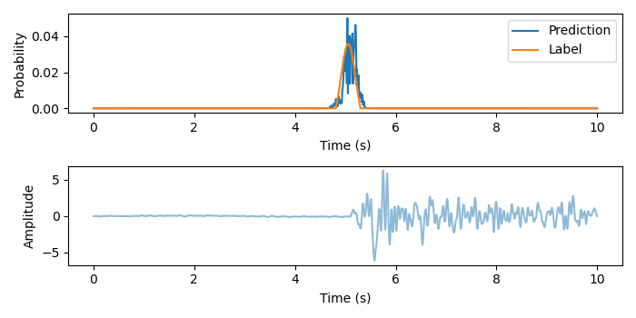

# CNN and LSTM Based NN Models to Pick P-wave Arrival

Datasets [Link](https://utexas.box.com/s/klymsiqu7t9jeesqvb053yb0w4tt8it7)

Trained Models and Example outputs [Link](https://utexas.box.com/s/kmv6bw9qtq1t3cb833rwdsjxr8t9xlgv)

## Intro
This code is from 2022 NHERI DesignSafe Hackathon project. It uses CNN or LSTM neural network model to predict P-wave arrival time in ground motions. 
The idea is inspired by [PhaseNet](https://github.com/wayneweiqiang/PhaseNet)

* Team members: Aser Abbas, Sajan K.C., Soolmaz Khoshkalam, Yongjin Choi
* Mentor: Meibai Li

## Run
```python
python3 train.py --data_path="dataset_example" --model_option="Conv1D" --out_ids 1 2 3 4 5
```

## Prediction Result

